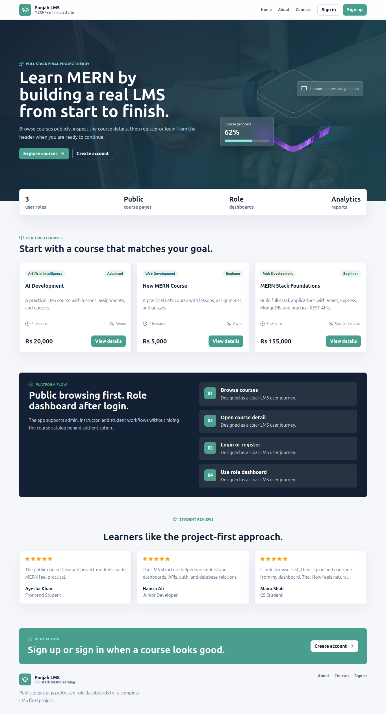
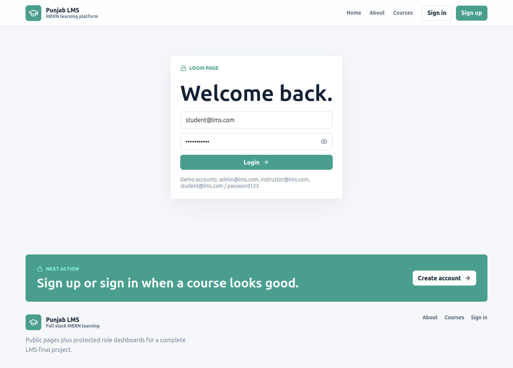
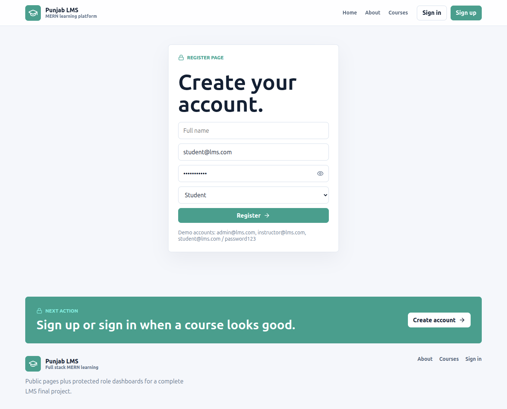
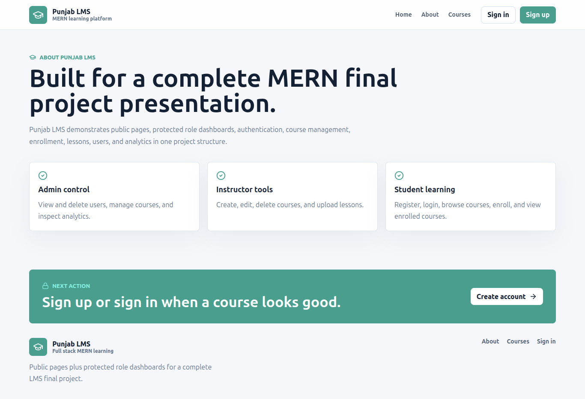
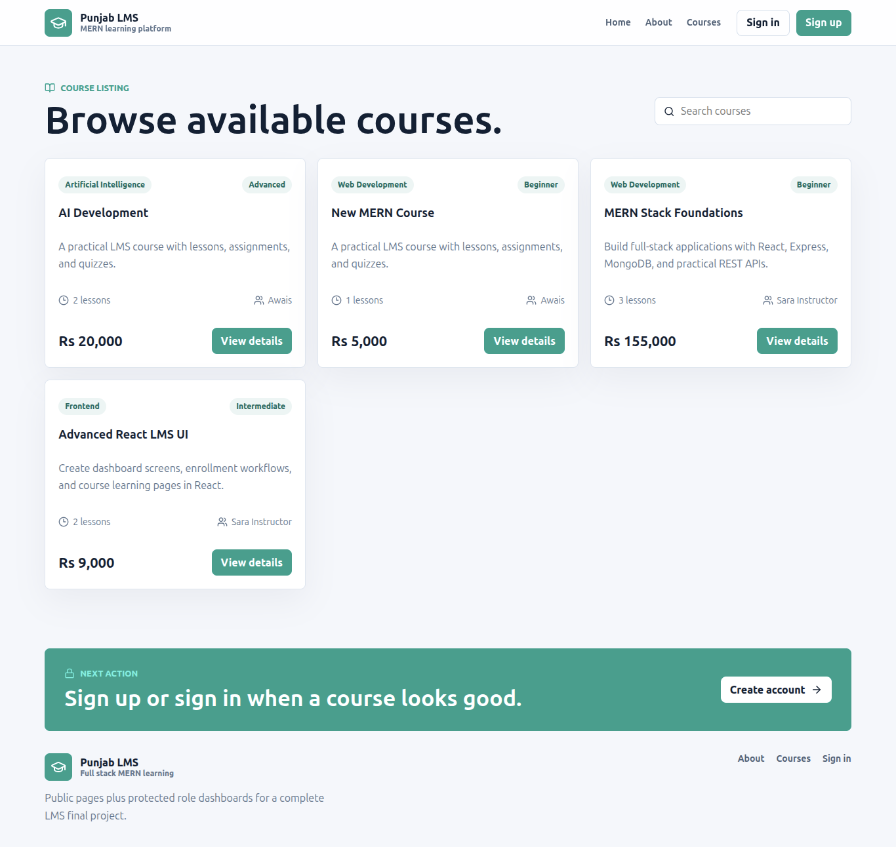
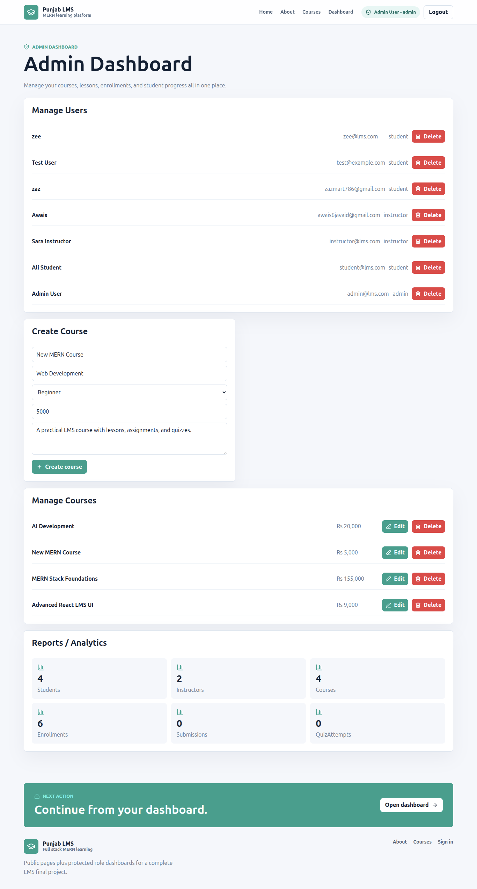
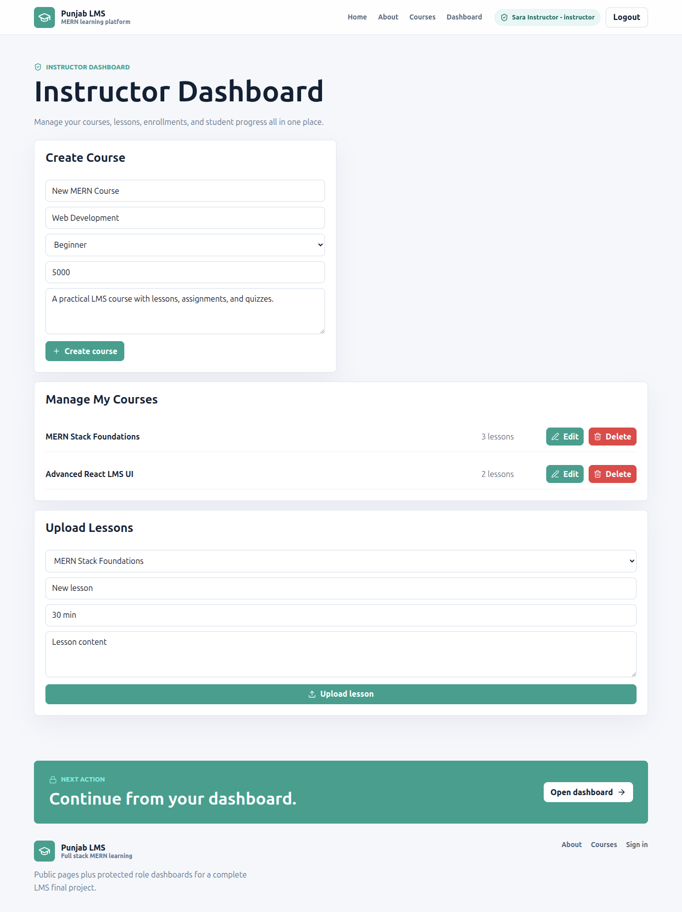
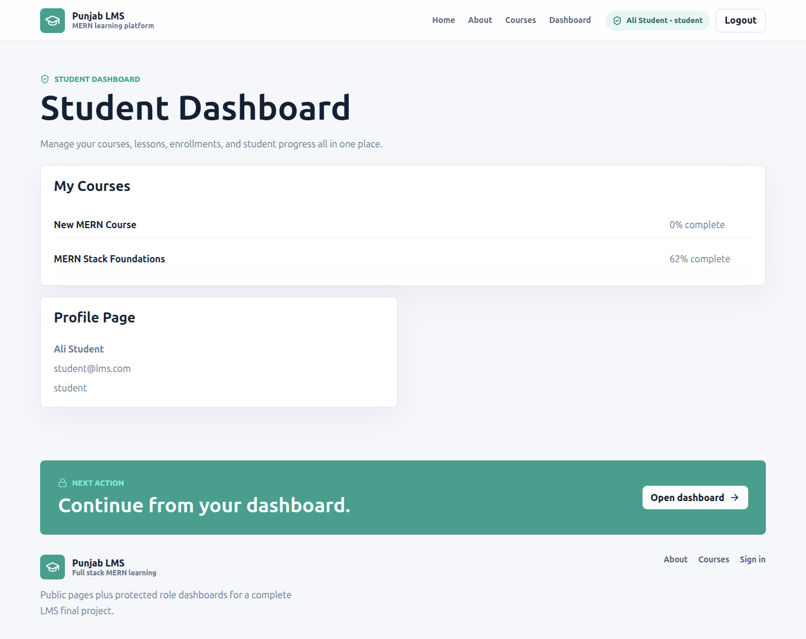

# MERN Stack Learning Management System

A full-stack LMS final project built with React, Node.js, Express, MongoDB, and Mongoose. It includes authentication, role-based authorization, course management, enrollments, progress tracking, quizzes, assignments, dashboard metrics, and a responsive React interface.

## Project Structure

- `Frontend/` - React + TypeScript + Vite LMS dashboard
- `Backend/` - Node.js + Express + MongoDB REST API
- `Backend/src/models/` - Mongoose schemas for users, courses, enrollments, submissions, and quiz attempts
- `Backend/src/routes/` - REST API route modules
- `Backend/src/controllers/` - Request handlers and business logic
- `Backend/src/middleware/` - Authentication, authorization, and error handling

## Installation

### Backend Setup

```bash
cd Backend
pnpm install
# Review and adjust environment variables in src/.env if needed
pnpm run seed
pnpm run dev
```

### Frontend Setup

```bash
cd Frontend
pnpm install
pnpm run dev
```

The frontend runs on `http://localhost:5173` and the backend API runs on `http://localhost:5000/api`.

### Environment Variables

The backend uses environment variables defined in `Backend/src/.env`. Key variables include:

- `PORT`: Server port (default: 5000)
- `MONGO_URI`: MongoDB connection string
- `JWT_SECRET`: Secret for signing JWT tokens
- `JWT_EXPIRES_IN`: Token expiration time
- `CLIENT_URLS`: Comma-separated list of allowed frontend URLs for CORS
- `NODE_ENV`: Environment mode (development/production)

### Seed Script

The seed script (`pnpm run seed`) initializes the database with:
- Sample users (admin, instructor, student)
- Sample courses with lessons, assignments, and quizzes
- Sample enrollment data

After seeding, you can log in with:
- Admin: `admin@lms.com` / `password123`
- Instructor: `instructor@lms.com` / `password123`
- Student: `student@lms.com` / `password123`

## Screenshots

Here are some screenshots of the LMS application:

| Feature | Screenshot |
|---------|------------|
| Landing Page |  |
| Sign In |  |
| Sign Up |  |
| About Page |  |
| Course Page |  |
| Admin Dashboard |  |
| Instructor Dashboard |  |
| Student Dashboard |  |

## Technologies Used

React, TypeScript, Vite, Lucide React, Axios, Node.js, Express, MongoDB, Mongoose, JWT, bcryptjs, dotenv, cors, and nodemon.

## Major Modules

- User registration and login
- JWT protected API routes
- Admin, instructor, and student role authorization
- Course CRUD for admins and instructors
- Course catalog for students
- Enrollment and progress tracking
- Assignment submissions
- Quiz attempts with score calculation
- Dashboard metrics for admin and instructor roles
